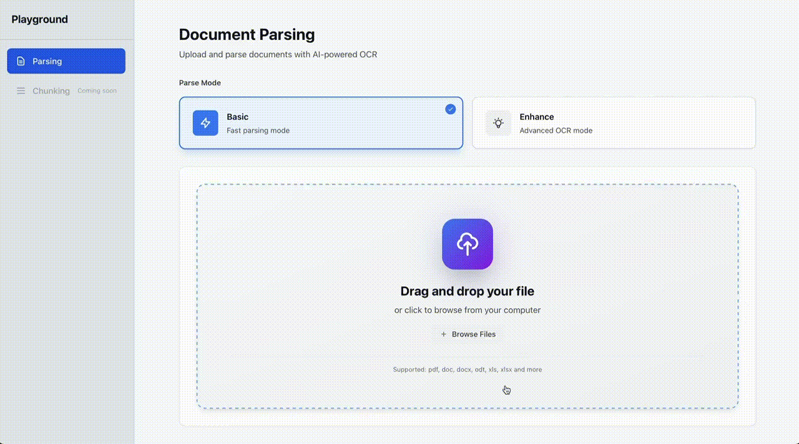

# Playground

## Demo



## Overview
Document parsing and extraction playground with extensible parser architecture.


## Getting Started

### Backend

```
cd backend
uv sync --all-extras
uv run uvicorn main:app --reload
```

### Frontend

```
cd frontend
npm install
npm run dev
```

### Redis & RQ Worker

```bash
# Install Redis (if not already installed)
sudo apt-get update
sudo apt-get install -y redis-server

# Start Redis server (if not already running)
redis-server --daemonize yes
```

In separate terminals, start RQ workers:
```bash
cd backend
uv run rq worker parse_queue
```

### Chunking (Peter-parser)

Chunking requires Peter-parser and its RQ worker.  
**경로:** 아래는 `playground`와 `pipelines`가 **같은 단계에 있는 디렉터리**(예: `source`) 기준입니다.  
`playground` 안에 있다면 Peter-parser는 `cd ../pipelines/parsing-pipeline/peter-parser` 로 이동하세요.

```bash
# Terminal 1: Peter-parser (port 8001)
cd pipelines/parsing-pipeline/peter-parser   # 또는 playground 안이면: cd ../pipelines/parsing-pipeline/peter-parser
uv run python main.py

# Terminal 2: Peter-parser RQ worker (필수 — 없으면 Chunking이 pending에서 멈춤)
cd pipelines/parsing-pipeline/peter-parser   # playground 안이면: cd ../pipelines/parsing-pipeline/peter-parser
uv run python -m peter_parser.worker         # 또는: ./scripts/start_peter_parser_worker.sh

# Terminal 3: Playground backend (port 8000)
cd playground/backend
uv run python main.py

# Terminal 4: Frontend
cd playground/frontend
NEXT_PUBLIC_API_URL=http://localhost:8000 npm run dev
```E2E test (when all services are running):
```bash
cd playground
uv run python scripts/e2e_chunking_test.py
```
(Requires `sample_excel.xlsx` in project root.)

### Chunking이 프론트에서만 안 될 때 (Peter-parser는 로컬에서 정상)

**원인:** 프론트는 API 요청을 `NEXT_PUBLIC_API_URL`로 보냅니다. 이 값을 설정하지 않으면 `next.config.js` 기본값인 **원격 백엔드**(예: `http://194.68.245.19:8000`)로 요청이 갑니다. 그 백엔드는 Chunking 요청을 받으면 **자기 서버의** `localhost:8001`로 Peter-parser를 호출합니다. Peter-parser는 사용자 PC의 8001에서 돌고 있으므로, 원격 서버 입장에서는 "자기 localhost:8001"에 아무것도 없어서 **연결 실패**가 납니다.

**해결:** 로컬에서 Playground 백엔드 + Peter-parser를 같이 쓸 때는 반드시 다음을 지킵니다.

1. **프론트엔드**가 로컬 백엔드를 바라보도록 설정  
   - `NEXT_PUBLIC_API_URL=http://localhost:8000` 로 프론트 실행  
   - 예: `NEXT_PUBLIC_API_URL=http://localhost:8000 npm run dev`
2. **Playground 백엔드**를 같은 PC에서 8000번으로 실행  
   - `cd backend && uv run uvicorn main:app --reload` (또는 `python main.py`)
3. **Peter-parser**를 같은 PC에서 8001번으로 실행  
   - `cd pipelines/parsing-pipeline/peter-parser && uv run python main.py`

이렇게 하면 흐름이 **브라우저 → localhost:8000(Playground) → localhost:8001(Peter-parser)** 가 되어, 모두 같은 머신의 localhost로 통신합니다.
